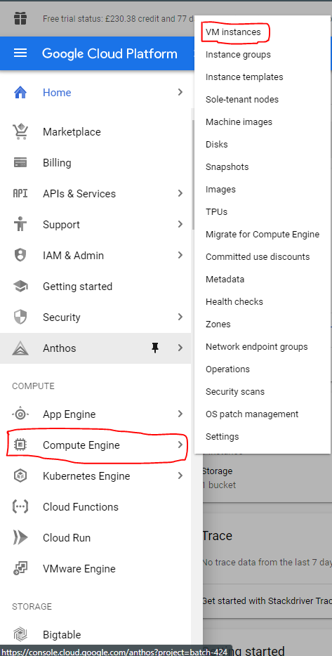
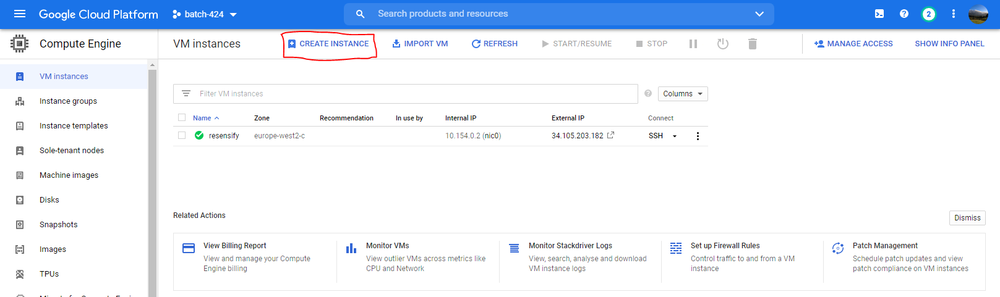
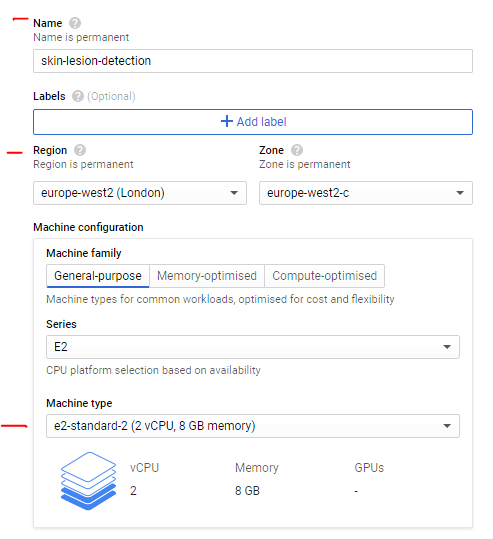
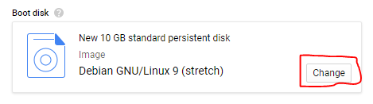
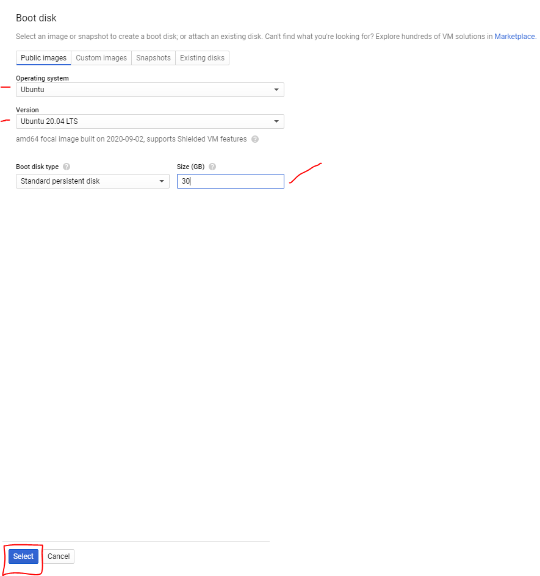
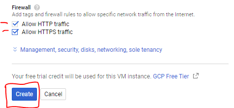
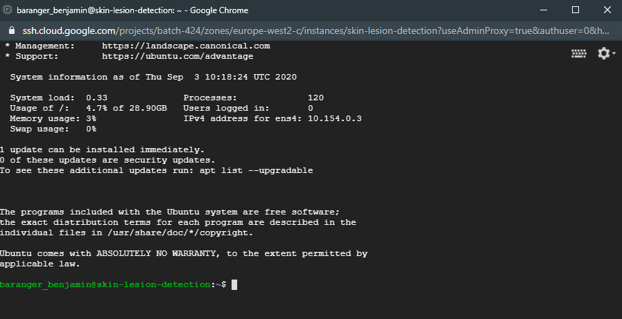

# Setup a machine on Google Compute Engine

Before we start, you need:

- A Google Cloud account
- Your app on a github repository

# Create the machine

Go to [GCP](https://console.cloud.google.com/)

Expand the menu on the top left and click on **Compute Engine --> VM Instances**



Click on **Create an instance**



Change the **name**, **region** and **machine type** like so:



For the boot disk, click on change



Fill the options like the image below and click on **select**



Firewall, check the two options:
    - Allow HTTP traffic
    - Allow HTTPS traffic

Click on **Create**



Your machine will be created. When it's done access to its terminal by cliking on **ssh** next to it




Run the following command:

```bash
sudo apt update
```

Then

```bash
sudo apt install -y zsh curl vim
```

Then

```bash
sh -c "$(curl -fsSL https://raw.githubusercontent.com/robbyrussell/oh-my-zsh/master/tools/install.sh)"
```

Confirm with `y` and pressing `enter` when you're prompted for your password.

Run the following command. Carefull to replace the email with the one you're using for github

```bash
mkdir -p ~/.ssh && ssh-keygen -t ed25519 -o -a 100 -f ~/.ssh/id_ed25519 -C "TYPE_YOUR_EMAIL@HERE.com"
```

Then

```bash
cat ~/.ssh/id_ed25519.pub
```

It will prompt on the screen the content of the id_ed25519.pub file. Copy that text, then go to [github.com/settings/ssh](https://github.com/settings/ssh). Click on Add SSH key, fill in the Title with your computer name, and paste the Key. Finish by clicking on the Add key green button.

To check that this step is completed, in the terminal run this. You will be prompted a warning, type yes then Enter.

```bash
ssh -T git@github.com
```

Type `yes` if required.

If you see something like this, you're done!

```bash
Hi <your_github_nickname>! You've successfully authenticated, but GitHub does not provide shell access
```

Don't blindly copy paste this line, replace replace_this_with_your_github_username with your own github usernickname.

```bash
export GITHUB_USERNAME=replace_this_with_your_github_username

# Example:
#   export GITHUB_USERNAME=ssaunier
```

Now copy/paste this very long line in your terminal. Do not change this one.

```bash
mkdir -p ~/code/$GITHUB_USERNAME && cd $_ && git clone git@github.com:$GITHUB_USERNAME/dotfiles.git
```

Run the dotfiles installer.

```bash
cd ~/code/$GITHUB_USERNAME/dotfiles
zsh install.sh
```

Then run the git installer:

```bash
cd ~/code/$GITHUB_USERNAME/dotfiles
zsh git_setup.sh
```

☝️ This will prompt you for your name (Firstname Lastname) and your email.

Be careful, you need to put the same email as the one you sign up with on GitHub.

Run the following:

```bash
git clone https://github.com/pyenv/pyenv.git ~/.pyenv
```

Then

```bash
sudo apt install -y make build-essential libssl-dev zlib1g-dev libbz2-dev \
  libreadline-dev libsqlite3-dev llvm libncurses5-dev libncursesw5-dev \
  xz-utils tk-dev libffi-dev liblzma-dev python-openssl
```

```bash
pyenv install 3.7.7
```

```bash
pyenv global 3.7.7
```

```bash
git clone https://github.com/pyenv/pyenv-virtualenv.git $(pyenv root)/plugins/pyenv-virtualenv
```

```bash
pyenv virtualenv 3.7.7 lewagon
```

```bash
pyenv activate lewagon
```

```bash
pip install --upgrade pip
```

```bash
cd ~/code
```

Now you can clone your project's github repository.

```bash
git@github.com:cecyprice/skin_lesion_detection.git
```

```bash
cd skin_lesion_detection/skin_lesion_detection
```

```bash
pip install .
pip install streamlit
```

Run your app with

```bash
streamlit run app.py
```

By default, the connection will be block from the outside.

Go back to [GCP](https://console.cloud.google.com/)

Expand the menu on the top left and click on **Compute Engine --> VM Instances**
